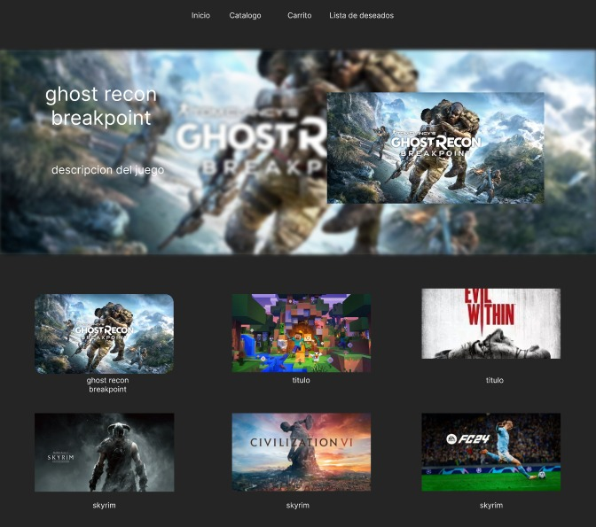

Proyecto de Programacion II

Este proyecto es una tienda de videojuegos responsive adaptada al celular y a computador.

Esta web contiene las siguientes paginas:

- Inicio: cuenta con un carrusel y una imagen la cual te invita a comprar en nuestra tienda realizado por Juan Emilio.

- Catalogo: cuenta con la lista de juegos importada de un archivo JSON, el cual pedimos a una inteligencia artificial que nos mande 60 juegos,
cada uno de ellos contiene su titulo, genero, precio, imagen y trailer del mismo. Mas especificamente son cartas las cuales podes agregar al carrito o incluir a tus favoritos. Te permite realizar busquedas por genero o por titulo
Realizado por Tomas Mascia

- Carrito: cuenta con un diseño el cual a medida que vas agregando juegos, se muestra una lista de los juegos que uno quiere comprar. Esta misma cuenta con un agregado para decidir si queres mas de un mismo juego. Tambien cuenta con una tarjeta a la derecha que contiene la suma de los juegos y tambien podes con el boton pagar tu carrito. Realizado por Joaquin Armoa

-Lista de deseados: cuenta con una lista parecida a las cartas que estan en el catalogo pero colocadas con mayor tamaño. Pudiendo tambien eliminar los juegos o dejarlos ahi para ver los que mas le gustan al usuario. Te permite realizar busquedas por genero o por titulo y contiene un filtro que te permite ordenar los juegos de la forma que mas te guste. Realizado por Isabella Pratta

- Perfil: cuenta con un login o register dependiendo del usuario, validaciones para ver si está ingresado o no.
Mostrando tambien y pudiendo cambiar la contraseña, el email o nickname que tenga el usuario. Realizado en grupo y pensado por todos.

Por aca dejamos el primer diseño que tuvimos como equipo, y lo que quisimos plasmar.
;

Aclaración: se puede notar en el trabajo una diferencia en la cantidad de commits de cada participante. Dado que es un requisito de la consigna, queríamos aclarar que tuvimos un problema al iniciar a trabajar con el warp que hizo que se borrara todo lo hecho, por lo que varios trabajamos solo en backup e hicimos los commits que pudimos considerando que hicimos todas las correcciones dentro de los mismos.

Demtrp de los primeros commits de Tomas fueron todos juntos en una misma casa, ya que al inicio nos juntamos para planear todo el codigo y lo que ibamos a hacer

Fue una experiencia muy divertida!!!

Como un detalle lo pudimos hostear en Vercel para poder abrirlo de distintos dispositivos sin tener que descargar todo. Muchas gracias!!

https://tp-programacion-ii.vercel.app/

Integrantes:
- Tomás Mascia
- Juan Emilio Novo
- Isabella Pratta Miranda
- Joaquin Armoa
